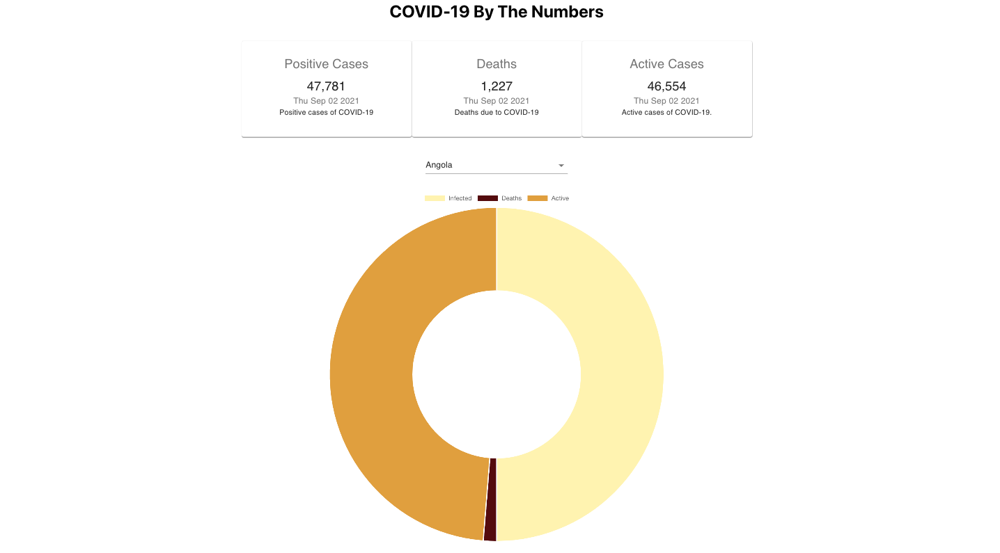

<!-- PROJECT LOGO -->
 

  

  <h3 align="center">Covid-19 By The Numbers</h3>

  

    A simple Covid-19 tracking application.
     
     
    <a href="https://sleepy-hamilton-f8ea80.netlify.app/">View App</a>
    ·
    <a href="https://github.com/Pete-Sekesan/covid-19-tracker/issues">Report Bug</a>
    ·
    <a href="https://github.com/Pete-Sekesan/covid-19-tracker/issues">Request Feature</a>
  

<!-- ABOUT THE PROJECT -->

## About The Project

<!-- 

   -->

This app was created to allow users to select from a large list of countries via a drop down and have it display the up to the minute data on that countries total number of Covid-19 cases and the associated number of those who unfortunately have been taken from us to this horrible pandemic. I am pulling in from an API that scrapes official government data to give up to date total numbers by country.

### Built With

- [HTML](https://developer.mozilla.org/en-US/docs/Web/HTML)
- [CSS](https://developer.mozilla.org/en-US/docs/Web/CSS)
- [JavaScript](https://www.javascript.com/)
- [React](https://reactjs.org/docs/getting-started.html)
- [react-chartjs-2](https://www.npmjs.com/package/react-chartjs-2)
- [MaterialUI](https://www.npmjs.com/package/react-chartjs-2)

<!-- USAGE EXAMPLES -->

## Usage

Select the country you would like to view for current stats, or select Global to get a total look at how the pandemic is progressing. You can select or deselect each key above the doughnut graph to view or hide that data from the graph.

<!-- ROADMAP -->

<!-- SCREEN SHOTS -->

## Screen Shots

### Landing page desktop view

## Roadmap

See the [open issues](https://github.com/Pete-Sekesan/covid-19-tracker/issues) for a list of proposed features (and known issues).

## Contact

Twitter - [@PeterSekesan](https://twitter.com/PeterSekesan)  
psekesan@gmail.com

Portfolio: https://peter-sekesan.dev

Project Link: [https://sleepy-hamilton-f8ea80.netlify.app/](https://sleepy-hamilton-f8ea80.netlify.app/)
